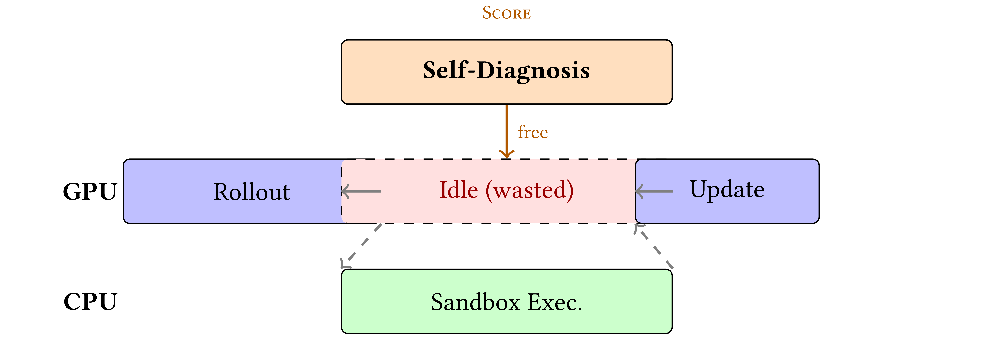

# SCORE: Self-diagnostic Critique On-policy Reasoning with Execution Feedback



This repository contains the implementation of **SCORE**, a framework that integrates metacognitive error self-diagnosis with blindspot-driven knowledge distillation for code generation.

## Requirements

- Python 3.10+
- CUDA 12.1+
- 2x NVIDIA GPUs with >= 40GB VRAM each (e.g., A100-40GB, H100-80GB)
- ~50GB disk space for model weights and checkpoints

## Installation

We use [uv](https://docs.astral.sh/uv/) for fast, reproducible environment setup.

```bash
# 1. Install uv (if not already installed)
curl -LsSf https://astral.sh/uv/install.sh | sh

# 2. Create a Python 3.12 virtual environment
cd /path/to/SCORE
uv venv --seed --python 3.12 ./train-env

# 3. Install all dependencies
uv pip sync -p ./train-env/bin/python ./requirements_uv.txt

# 4. Activate the environment
source ./train-env/bin/activate


```

## Dataset

SCORE trains on **LiveCodeBench v6** (LCB-v6), a contamination-free competitive programming benchmark with 131 contest-level problems. The dataset is included in `datasets/lcb_v6/` as parquet files.

## Training (Qwen3-4B)

**Step 1.** Edit `run_score_4b.sh` and replace the path placeholders:

```bash
# Replace these two placeholders with your actual paths:
/path/to/scratch   ->  your scratch/storage directory (for caches and checkpoints)
/path/to/SCORE     ->  the absolute path to this repository
```

**Step 2.** Launch training:

```bash
source ./train-env/bin/activate
bash run_score_4b.sh
```

Training uses 2 GPUs with tensor parallelism. Key hyperparameters:

| Parameter | Value |
|---|---|
| Base model | Qwen/Qwen3-4B |
| Learning rate | 1e-6 |
| Batch size | 32 |
| Rollouts per problem | 8 |
| Max prompt length | 4,096 tokens |
| Max response length | 8,192 tokens |
| EMA teacher update rate | 0.01 |
| Distillation top-K | 20 |
| Total training steps | 135 |
| Checkpoint interval | every 5 steps |

Logs are written to `logs_score_try3_sft-qwen3-4b-lcb-v6_2.txt`. Checkpoints are saved to the `trainer.default_local_dir` path specified in the script.

## Evaluation

Evaluate a checkpoint on the LCB-v6 test set:

```bash
# Edit eval_checkpoint.sh and replace the path placeholders (same as training)
# Then run:
bash eval_checkpoint.sh /path/to/checkpoint_dir
```

This runs the model on LCB-v6 test problems with 4 rollouts per problem (temperature=0.6, top_p=0.95) and writes results to `eval_results.txt`.

## Project Structure

```
SCORE/
├── run_score_4b.sh              # Training script (Qwen3-4B, 2 GPUs)
├── eval_checkpoint.sh           # Evaluation script
├── eval_checkpoint.py           # Evaluation logic
├── datasets/lcb_v6/             # LiveCodeBench v6 data (train + test)
├── verl/                        # Modified verl framework
│   ├── trainer/
│   │   ├── config/score.yaml    # SCORE hydra config
│   │   ├── main_ppo.py          # Entry point
│   │   └── ppo/ray_trainer.py   # Training loop with self-diagnosis
│   ├── workers/
│   │   ├── actor/dp_actor.py    # Actor with EMA teacher
│   │   └── fsdp_workers.py      # FSDP worker with distillation
│   └── utils/reward_score/      # Reward and error classification
├── requirements_uv.txt          # Pinned dependencies (for uv pip sync)
├── requirements.txt
└── README.md
```

## Acknowledgements

Built on top of the [verl](https://github.com/volcengine/verl) framework.
